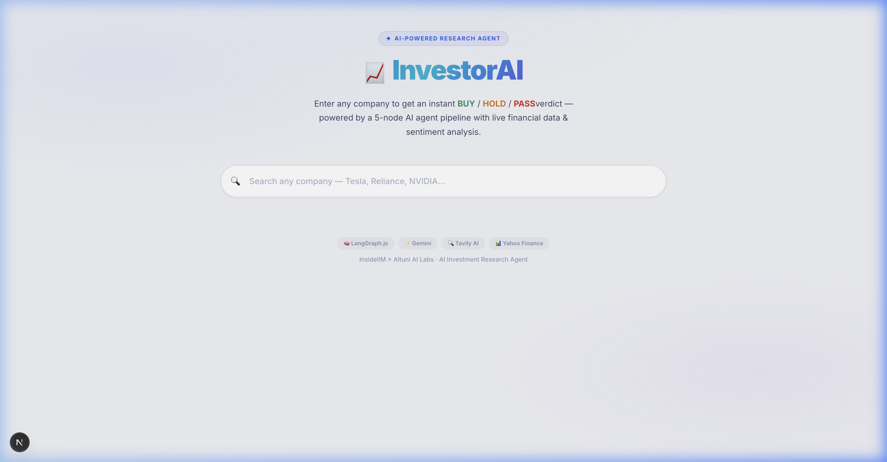
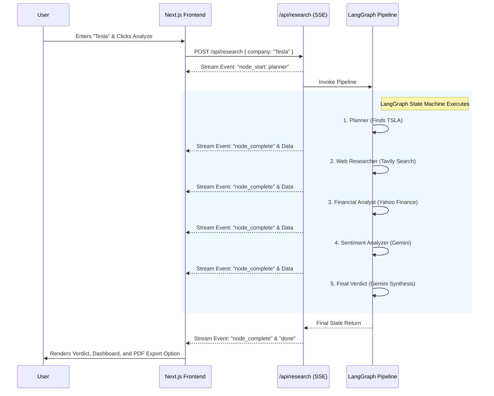
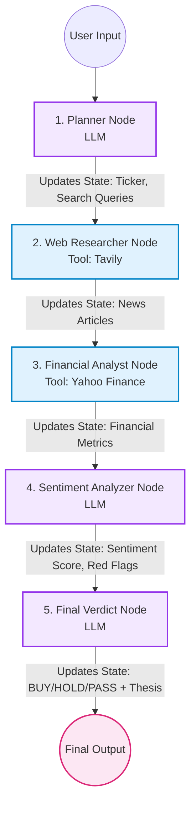
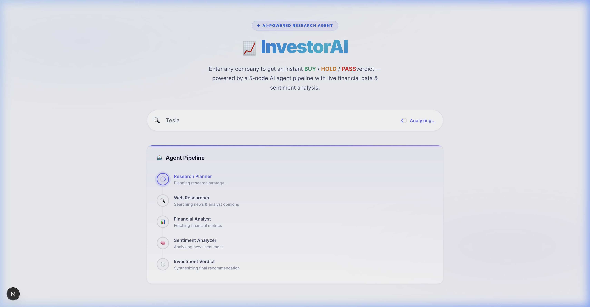
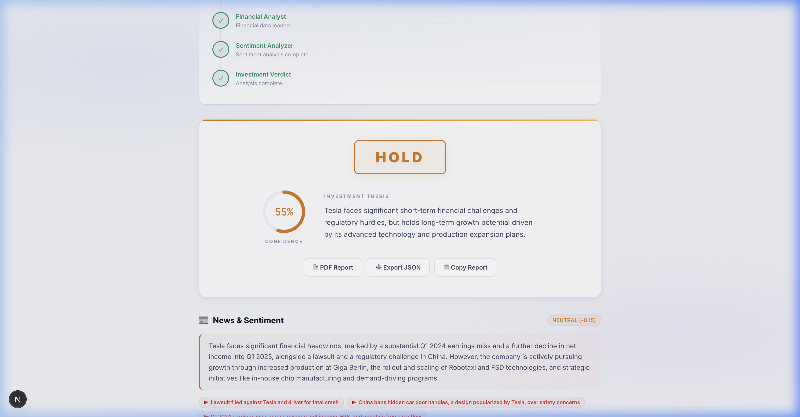
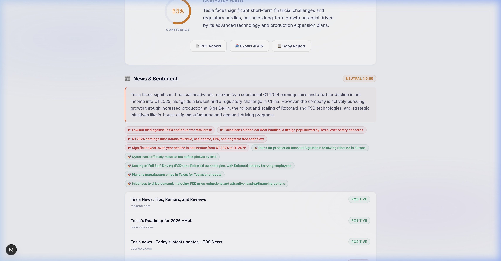
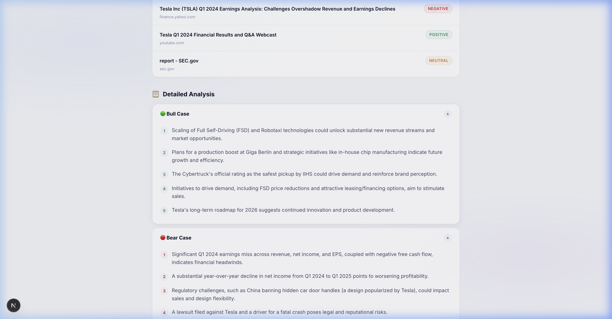

# 📈 InvestorAI — AI-Powered Investment Research Agent



> **InsideIIM × Altuni AI Labs Take-Home Assignment**
> Built by Pranav Singh | AI Product Development Engineer (Intern) Applicant

InvestorAI is an autonomous, multi-agent investment research pipeline. Given a company name, it automatically discovers the ticker, scrapes real-time news, fetches financial data, analyzes sentiment, and synthesizes a professional **BUY**, **HOLD**, or **PASS** recommendation with full reasoning.

Built with **Next.js (App Router)**, **LangGraph.js**, **Gemini 2.5 Flash**, **Tavily AI**, and **Yahoo Finance**.

---

## 🌟 Key Features

- **Multi-Agent Pipeline**: A state-machine powered by LangGraph that orchestrates specialized LLM agents (Planner, Researcher, Financial Analyst, Sentiment Analyzer, Final Verdict).
- **Real-Time Data**: Uses Tavily AI to search the live web for recent news, analyst opinions, and market developments.
- **Financial Metrics**: Integrates with Yahoo Finance API to pull live market cap, P/E ratios, revenue growth, and more.
- **Live SSE Streaming**: Watch the agent "think" in real-time. The UI streams node progress, state updates, and errors instantly via Server-Sent Events.
- **Premium Glassmorphic UI**: Bloomberg-grade aesthetic with section-specific color personalities, dynamic hover reveals, and fluid animations.
- **PDF Export**: Generate professional, branded PDF reports of the research analysis with a single click using `jsPDF`.
- **LLM Rate-Limit Resiliency**: Built-in exponential backoff to handle free-tier API quotas gracefully.

----

## 🧠 The AI Brain: Model & Reasoning

### Model Choice: **Gemini 2.5 Flash** (`gemini-2.5-flash`)
We utilize Google's Gemini 2.5 Flash model for the entire pipeline.
- **Why Flash?** Speed is critical for an interactive web app. Flash delivers near-instantaneous reasoning, which is essential when chaining 5 LLM calls together in a single user request.
- **Why 2.5?** The 2.5 generation offers superior structured output capabilities (crucial for returning strictly formatted JSON states) and improved reasoning for financial synthesis.
- **Configuration**: Temperature is set to `0.3` to minimize hallucinations and prioritize factual, analytical output over creative prose.

*(Note: The app features robust exponential backoff to handle the 15 RPM free-tier limit of the Gemini API).*

---

## 🔄 How It Works: Process & Architecture

### User Experience Flow


### Agent Workflow Diagram (LangGraph)


---

## 📸 Application Screenshots

### 1. Active Agent Pipeline (Streaming)
The frontend streams the progress of the LangGraph state machine in real-time.


### 2. Investment Verdict
Dynamic UI that changes colors based on the final decision (Buy=Green, Hold=Amber, Pass=Red).


### 3. News & Sentiment Analysis
Extracts red flags, catalysts, and assigns a sentiment score to recent news.


### 4. Detailed Breakdown
Expandable sections detailing the Bull Case, Bear Case, Key Risks, and the model's full reasoning.


---

## 🛠️ Tech Stack Details

- **Framework**: [Next.js 16](https://nextjs.org/) (App Router)
- **AI Orchestration**: [LangGraph.js](https://langchain-ai.github.io/langgraphjs/)
- **LLM**: [Gemini 2.5 Flash](https://deepmind.google/technologies/gemini/flash/) (via `@langchain/google-genai`)
- **Web Search**: [Tavily AI](https://tavily.com/)
- **Market Data**: `yahoo-finance2`
- **Styling**: Tailwind CSS + Custom Vanilla CSS (Glassmorphism)
- **PDF Generation**: `jspdf` + `jspdf-autotable`

---

## 🚀 Getting Started (Local Development)

### Prerequisites
You will need API keys for:
1. **Google AI Studio (Gemini)**: `GOOGLE_API_KEY`
2. **Tavily AI**: `TAVILY_API_KEY`

### Installation

1. **Clone the repository**
   ```bash
   git clone <repo-url>
   cd investor-agent
   ```

2. **Install dependencies**
   ```bash
   npm install
   ```

3. **Configure Environment Variables**
   Create a `.env.local` file in the root directory:
   ```env
   GOOGLE_API_KEY=your_gemini_key_here
   TAVILY_API_KEY=your_tavily_key_here
   ```

4. **Run the Development Server**
   ```bash
   npm run dev
   ```
   Open [http://localhost:3000](http://localhost:3000) in your browser.

---

## 📝 LLM Build Session Transcript
As per the assignment requirements, the complete chat transcript of the AI-assisted development session is included. It provides insight into the iterative thought process, architecture decisions, and debugging steps.

👉 **[View the LLM Build Session Transcript](llm-transcript/build-session.md)**

---
*Designed & Built for the InsideIIM / Altuni AI Labs Take-Home Assignment.*
